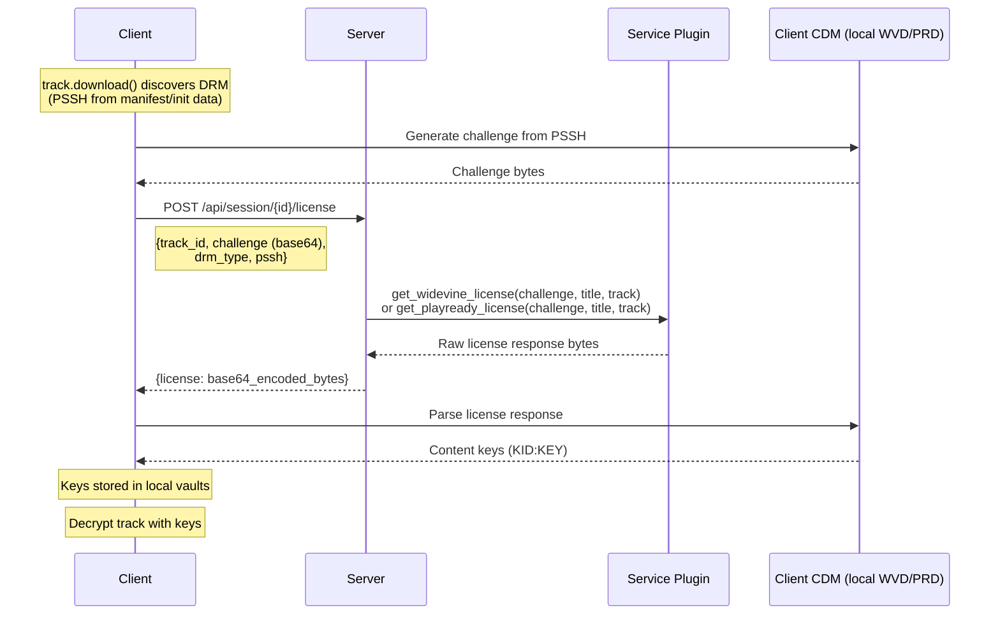
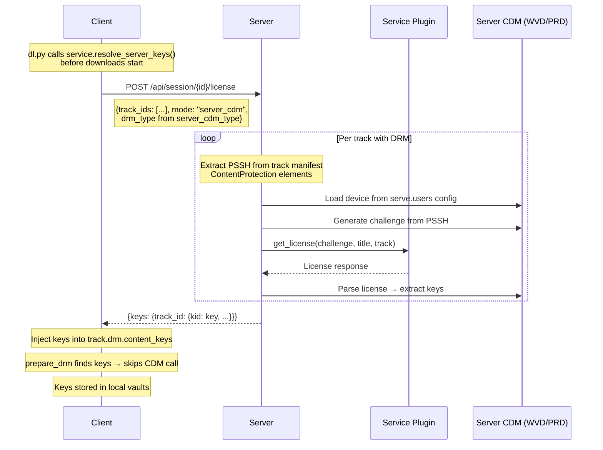
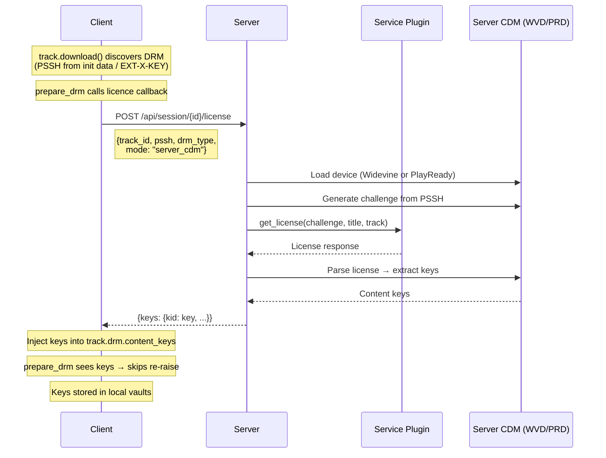

# Remote Services — Client ↔ Server Architecture

The `--remote` flag on the `dl` command connects to a remote unshackle server
(`unshackle serve`) that holds service plugins. The client never has service
code — it sends credentials/cookies, the server authenticates and fetches
titles/tracks, and the client handles downloading, decryption, and muxing locally.

## How It Works

The `RemoteService` adapter in `remote_service.py` implements the same interface
as a local `Service`. From dl.py's perspective, it's just another service — the
entire download pipeline runs unchanged.

```
unshackle dl --remote [-s server_name] SERVICE_TAG TITLE_ID [options]
```

## Session Lifecycle

```mermaid
sequenceDiagram
    participant Client as Client (dl --remote)
    participant Server as Server (serve API)
    participant Service as Service Plugin

    Note over Client: Load credentials/cookies locally
    Note over Client: Detect client region via IP check

    Client->>Server: POST /api/session/create
    Note right of Client: {service, title_id, credentials,<br/>cookies, client_region, profile}

    Note over Server: Check if server region matches client<br/>Skip proxy if same region
    Server->>Service: authenticate(cookies, credential)
    Service-->>Server: Authenticated session
    Server-->>Client: {session_id, service}

    Client->>Server: GET /api/session/{id}/titles
    Server->>Service: get_titles(title_id)
    Server-->>Client: Serialized titles (episodes/movies)

    Note over Client: dl.py filters by --wanted

    Client->>Server: POST /api/session/{id}/tracks
    Server->>Service: get_tracks(title)
    Server->>Service: get_chapters(title)
    Note over Server: Extract manifest XML as base64<br/>Extract service session cookies/headers<br/>Detect server CDM type from track DRM + config
    Server-->>Client: Tracks + manifests + chapters +<br/>session cookies + server_cdm_type

    Note over Client: Re-parse manifest locally (DASH/ISM)<br/>HLS tracks download from URL directly
    Note over Client: Match tracks by ID to populate track.data
    Note over Client: dl.py runs full track selection pipeline

    rect rgb(40, 40, 60)
        Note over Client: Licensing (depends on mode)
    end

    rect rgb(40, 60, 40)
        Note over Client: Download + Post-Processing (all local)
        Note over Client: Concurrent downloads via ThreadPoolExecutor
        Note over Client: Decrypt (mp4decrypt / Shaka Packager)
        Note over Client: FFMPEG repack
        Note over Client: Subtitle conversion
        Note over Client: Hybrid HDR10+DV injection (dovi_tool)
        Note over Client: Per-resolution muxing (mkvmerge)
        Note over Client: Output naming from template
        Note over Client: Tagging (TMDB/IMDB/TVDB)
    end

    Client->>Server: DELETE /api/session/{id}
    Server-->>Client: Session cleaned up
```



---

## Licensing Modes

### Proxy Mode (`server_cdm: false` — default)

The client has its own CDM (WVD/PRD file). The server only proxies the license
request through the authenticated service session.



**Key points:**

- Client must have a local CDM device file (`.wvd` or `.prd`)
- Server never sees decryption keys — only forwards encrypted license blob
- Client parses the license locally to extract keys
- Keys are cached in local vaults for future use

### Server-CDM Mode (`server_cdm: true`)

The server handles all CDM operations using its own devices. The client does
not need a local CDM. There are two paths depending on when DRM is discovered:

#### Path A: Pre-fetch (DASH services with manifest DRM)

For services where DRM info is in the manifest (ContentProtection elements),
the server resolves keys before downloads start.



#### Path B: On-demand (HLS services / late DRM discovery)

For services like ATV where DRM is only discovered during download (from init
segments or EXT-X-KEY tags), keys are fetched per-track during download.



**Key points:**

- Client does NOT need a local CDM device file
- Server uses devices from `serve.users.{api_key}.devices` (Widevine) and
  `serve.users.{api_key}.playready_devices` (PlayReady)
- Server detects DRM type from actual track DRM objects and available devices
- Keys are returned as `{kid_hex: key_hex}` pairs
- Keys are still cached in client's local vaults (unless `--cdm-only` is used)
- `prepare_drm` skips local CDM if all KIDs already have keys

---

## Configuration

### Client (`unshackle.yaml`)

```yaml
remote_services:
  my_server:
    url: "https://server:8786"
    api_key: "your-secret-key"
    server_cdm: true # server handles licensing (optional, default: false)
    services: # per-service overrides (optional)
      EXAMPLE:
        downloader: n_m3u8dl_re
        decryption: mp4decrypt
      EXAMPLE2:
        downloader: n_m3u8dl_re
```

### Server (`unshackle.yaml`)

```yaml
serve:
  api_secret: "your-secret-key"
  users:
    "your-secret-key":
      username: api_user
      devices: # Widevine CDMs
        - xiaomi_mi_a1_15.0.0_l3
      playready_devices: # PlayReady CDMs
        - qingdao_haier_tv_sl3000
```

---

## Manifest Data Transfer

Track manifests (DASH XML, ISM XML) cannot be JSON-serialized directly (they
contain lxml Element objects). The server serializes them as base64 strings in
the `/tracks` response. The client decodes and re-parses them locally.

| Manifest | Serialization               | Client Re-parse                                | Notes                             |
| -------- | --------------------------- | ---------------------------------------------- | --------------------------------- |
| **DASH** | `etree.tostring()` → base64 | `DASH(etree.fromstring(xml), url).to_tracks()` | Match by track ID (crc32 hash)    |
| **HLS**  | Not needed                  | Downloads playlist from `track.url` directly   | `HLS.download_track()` re-fetches |
| **ISM**  | `etree.tostring()` → base64 | `ISM(etree.fromstring(xml), url).to_tracks()`  | Match by track ID                 |

The `/tracks` response also includes:

- `session_headers` / `session_cookies` — for CDN authentication
- `server_cdm_type` — "widevine" or "playready" (detected from track DRM + config)

---

## Region & Proxy Handling

1. Client detects its own country via `get_cached_ip_info()`
2. Sends `client_region` in session create (no IP sent, just country code)
3. Server checks its own region — if it matches, no proxy needed
4. If regions differ, server resolves a proxy from its own providers
5. Client can also send explicit `--proxy` which takes precedence

---

## Comparison: Proxy vs Server-CDM

|                         | Proxy Mode (default)          | Server-CDM Mode                  |
| ----------------------- | ----------------------------- | -------------------------------- |
| **Client needs CDM**    | Yes (WVD/PRD file)            | No                               |
| **License request**     | Client sends challenge bytes  | Client sends PSSH (or track IDs) |
| **License response**    | Raw license bytes             | KID:KEY pairs                    |
| **Key extraction**      | Client CDM parses license     | Server CDM parses license        |
| **What leaves server**  | Encrypted license blob        | Decryption keys                  |
| **Vault caching**       | Client caches keys            | Client caches keys               |
| **`--cdm-only` effect** | Skip vaults, CDM only         | Skip vaults, server CDM only     |
| **Config**              | `server_cdm: false` (default) | `server_cdm: true`               |

## API Endpoints

| Endpoint                    | Method | Purpose                           |
| --------------------------- | ------ | --------------------------------- |
| `/api/session/create`       | POST   | Authenticate, create session      |
| `/api/session/{id}/titles`  | GET    | Get titles for session            |
| `/api/session/{id}/tracks`  | POST   | Get tracks + manifests + chapters |
| `/api/session/{id}/license` | POST   | License proxy or server-CDM keys  |
| `/api/session/{id}`         | GET    | Check session validity            |
| `/api/session/{id}`         | DELETE | Cleanup session                   |
