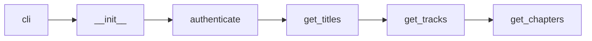

# Creating a Service

A **service** is a plugin that teaches unshackle how to talk to one streaming
platform: how to log in, how to look up a title, what video/audio/subtitle
tracks exist, and how to license any DRM. The unshackle core does everything
else (track selection, downloading, decryption, muxing, naming).

!!! info "Who this page is for"
    This is a **developer guide**. If you only want to *use* services, see
    [downloading](../guide/downloading.md) and
    [configuration](../reference/configuration/index.md). You do not need anything here to
    operate the CLI. The code of a service is deliberately separate from the
    core, so it can live in its own private repository.

unshackle ships two reference services. **EXAMPLE**, at
`unshackle/services/EXAMPLE/`, is a non-runnable showcase of every framework
feature in a single file. Read it alongside this page. Most snippets below come
from it. **MUSIC_EXAMPLE**, at `unshackle/services/MUSIC_EXAMPLE/`, is the same
kind of showcase for a music service. If your platform has songs, read that one too.

---

## How unshackle finds a service

At startup unshackle scans every path in the `directories.services` config key
(a **list**). Each entry is either a local directory of services or a remote
repo spec (a git URL or `owner/repo` shorthand, which unshackle clones for you).
The default is the bundled `unshackle/services` directory.

Within a services directory, **every subfolder that contains an `__init__.py`
is a service**, and the folder name is the service **tag**:

```text
services/
└── EXAMPLE/
    ├── __init__.py     # required - defines the service class
    └── config.yaml     # optional - per-service configuration
```

Two rules the loader enforces:

1. **The class name must match the folder/tag name exactly.** Folder `EXAMPLE` must
   define `class EXAMPLE`. A mismatch raises a `RuntimeError`.
2. **List order is priority.** The first services path to define a given tag
   wins, and unshackle ignores the later duplicates. Put your own local overrides *last* to
   use them as fallbacks, or *first* to override a repo.

After installation, you call a service as a subcommand of `dl`:

```bash
unshackle dl EXAMPLE 20914
unshackle dl EX 20914          # via an ALIAS
```

!!! tip "Config lives next to the code"
    A service's own settings go in `config.yaml` **inside the service folder**
    (`directories.services/<TAG>/config.yaml`). This is separate from the global
    `unshackle.yaml`. Access it in code as `self.config[...]`. Never hardcode
    URLs, user agents, or certificates. Put them here.

!!! warning "`config.yaml` is shared: keep secrets out of it"
    Treat `config.yaml` as a checked-in file of **defaults**: it belongs in the
    service repo, and everyone who runs the service shares it. Per-user secrets
    (API keys, device IDs, account tokens) must **not** live here. Those go in the
    user's own `unshackle.yaml` under `services.<TAG>`, which is **merged into
    `self.config` at runtime**. That checked-in-defaults / per-user-overrides
    split is exactly why every URL lives in `config.yaml` with `{}`/`{name}`
    placeholders while the secrets that fill them stay out of it. Both halves
    read back through the same `self.config[...]`.

!!! warning "Split across files? Use relative imports"
    If your service grows beyond a single `__init__.py`, import your own
    modules **relatively**:

    ```python
    from .helpers import parse_manifest        # correct
    from unshackle.services.TAG.helpers import parse_manifest   # breaks from a repo
    ```

    A service loaded from a remote repo lives outside the `unshackle` package,
    so Python cannot find the absolute `unshackle.services.<TAG>.*` path and the
    import fails with `no known parent package`. Relative imports work both
    locally and from a cloned repo.

---

## The Service base class

Every service subclasses `unshackle.core.service.Service`. The minimum is a
Click `cli` entry point plus three abstract methods.

### Class variables

Declared at class level to configure framework behaviour:

| Variable | Type | Purpose |
|---|---|---|
| `ALIASES` | `tuple[str, ...]` | Extra tags that resolve to this service (e.g. `("EX", "DOMAIN")`). Default `()`. |
| `GEOFENCE` | `tuple[str, ...]` | IP region codes the service requires. Empty = no geofence. The **first** entry is treated as the main region for auto-proxy. |
| `VAULT_TAG` | `Optional[str]` | Overrides the key-vault namespace so sibling services can share one vault. Default `None` (use the service's own tag). |
| `AUTH_METHODS` | `Optional[tuple[str, ...]]` | Auth methods accepted (`"cookies"` / `"credentials"`). When `None`, the REST `/services` endpoint infers them from `authenticate()`. |
| `NO_SUBTITLES` | `bool` | Set `True` on a service with no subtitle tracks to skip subtitle handling entirely. |
| `ANIME` | `bool` | Set `True` when the catalogue is anime, so metadata lookups prefer AniList. A title's own `anime` flag overrides it. |
| `DAILY` | `bool` | Set `True` when the catalogue is daily/date-based (talk shows, news, sports), so episodes are named by air date. A title's own `daily` flag overrides it. |

!!! note "`NO_SUBTITLES` is a convention, not a base-class attribute"
    `dl.py` uses `hasattr` to find `NO_SUBTITLES`, and the `Service` base class
    deliberately does **not** declare it, so it only exists if your service
    defines it. Setting `NO_SUBTITLES = True` is what makes the pipeline skip
    subtitle work for services that never carry subtitles. Leave it off otherwise.

`GEOFENCE` drives an automatic proxy: on startup, if you did not pass an
explicit `--proxy`, the base class does a live IP check and, if your region is
blocked, fetches a proxy to `GEOFENCE[0]` from your configured proxy providers.

```python
class EXAMPLE(Service):
    ALIASES = ("EX", "DOMAIN")
    GEOFENCE = ("US", "UK")
    VAULT_TAG = "DIFFERENT_NAME"
```

### What `Service.__init__` wires up

When you call `super().__init__(ctx)`, the base class sets up the attributes you
will use throughout the service:

| Attribute | What it is |
|---|---|
| `self.config` | This service's `config.yaml` contents (a dict), or `None` if absent. |
| `self.log` | A `logging.Logger` named after your class. |
| `self.session` | A prepared `requests.Session` with config headers and a retry adapter (5 retries, backoff 0.2, retries on 429/500/502/503/504). |
| `self.cache` | A `Cacher` for arbitrary key/value data, for example authentication tokens. |
| `self.title_cache` | A region/account-aware `TitleCacher` used by `get_titles_cached`. |
| `self.cache_dir` | `config.directories.cache / <ClassName>`. |
| `self.track_request` | A `TrackRequest` built from the CLI `--vcodec` / `--range` / `--best-available` flags. |
| `self.credential` | `None` until `authenticate()` runs. |
| `self.current_region` | The two-letter region resolved from proxy/IP. |

`self.track_request` is a small dataclass you can read *and rewrite* before
fetching tracks:

```python
@dataclass
class TrackRequest:
    codecs: list[Video.Codec] = []            # empty == accept any codec
    ranges: list[Video.Range] = [Video.Range.SDR]
    best_available: bool = False
```

!!! note "Read the request, don't second-guess the user"
    Services may narrow `track_request` for hard technical constraints (e.g.
    *"this service delivers HDR only as HEVC"*), but must **not** filter
    the tracks they return by resolution, bitrate, or language. All selection is
    done by the core after `get_tracks` returns.

!!! tip "Override `get_session()` to defeat TLS-fingerprint bot detection"
    The base `get_session()` returns a plain `requests.Session` (config headers +
    retry adapter) and **deliberately does not** do TLS impersonation. When a
    streaming platform blocks you on TLS fingerprint alone, override it to return
    `session("Chrome131")` (any `rnet.Impersonate` preset). `RnetSession` is a
    drop-in `requests.Session` replacement (same `.get`/`.post`/cookie-jar
    interface), so nothing else in the service changes. If instead you need
    specific SSL *cipher* behaviour, mount
    `unshackle.core.utils.sslciphers.SSLCiphers` onto a plain `requests.Session`.

---

## The methods you write

unshackle calls the methods in the order shown. Only the three abstract ones are mandatory.



### `cli`: the Click entry point

A static method decorated as a Click command. It defines the CLI arguments and
returns an **instance** of your service. Keep the command `name=` matching the
tag.

!!! note "`name=` is cosmetic: the directory name is what resolves the command"
    unshackle chooses the command from the **folder/class name**, not from the
    `name=` in `@click.command`. A mismatched `name=` still loads and runs. It
    only produces confusing `--help`/usage output that names the wrong command.
    That confusing output is the reason to keep it in sync, not any requirement
    of the command lookup.

```python
@staticmethod
@click.command(name="EXAMPLE", short_help="https://domain.com", help=__doc__)
@click.argument("title", type=str)
@click.option("-m", "--movie", is_flag=True, default=False, help="Treat the title as a movie.")
@click.option("-d", "--device", type=click.Choice(["android_tv", "web", "ios"]), default="android_tv")
@click.pass_context
def cli(ctx: click.Context, **kwargs: Any) -> EXAMPLE:
    return EXAMPLE(ctx, **kwargs)

def __init__(self, ctx: click.Context, title: str, movie: bool, device: str):
    self.title = title
    self.movie = movie
    self.device = device
    super().__init__(ctx)  # wires up config, log, session, caches, track_request...
    self.cdm = ctx.obj.cdm
```

Your docstring becomes the CLI `--help` text (`help=__doc__`), so document the
accepted URL/ID formats and options there.

!!! tip "CDM-aware behaviour"
    The resolved CDM is on `ctx.obj.cdm` (may be `None` for DRM-free runs). Use
    `is_widevine_cdm()` / `is_playready_cdm()` from `unshackle.core.cdm.detect`
    to classify it. These work correctly for local *and* remote CDMs, so never
    hand-roll an `isinstance` check. Services often pick a device profile or
    manifest endpoint based on which DRM the CDM speaks.

### `authenticate`: optional login

Override to log in with cookies and/or credentials. **Call `super().authenticate()`
first**: the base implementation loads the cookie jar into `self.session.cookies`
and stores `self.credential`. Do all token fetching here. It runs before
`get_titles`.

```python
def authenticate(self, cookies=None, credential=None) -> None:
    super().authenticate(cookies, credential)
    self.session.headers.update({"user-agent": self.config["client"][self.device]["user_agent"]})

    cache = self.cache.get(f"tokens_{self.device}_{self.profile}")
    if cache and cache.data.get("expires_in", 0) > int(datetime.now().timestamp()):
        self.log.info(" + Using cached tokens")
    else:
        token = self.session.post(self.config["endpoints"]["login"], data=body).json()
        cache.set(data=token, expiration=token.get("expires_in"))
    self.token = cache.data["token"]
```

Cookies come from files under `directories.cookies`. Credentials come from the
`credentials` map in `unshackle.yaml`. For interactive prompts (OTP, captcha)
use `self.request_input(prompt)`, never a bare `input()`. Under `serve` mode
there is no local terminal, so a bare `input()` would hang the server waiting on
stdin that never arrives. `request_input` instead relays the prompt to the
remote client through the attached `InputBridge`. Locally it routes through the
shared Rich console (`prompt_user`) so the prompt renders correctly alongside
progress and log output.

!!! warning "Make each token cache entry unique"
    The cache above uses `tokens_{device}_{profile}` on purpose. A token cache
    must include every dimension that changes the token (device, profile, or
    `credential.sha1`), or two profiles/devices will share one cache entry and
    stomp each other's tokens. This is not obvious from the caching API, which
    happily lets you use a single flat name.

!!! warning "Use the credential carefully"
    Use the `Credential` only inside `authenticate()` to get tokens. Do not
    stash it or the raw cookie jar elsewhere. The base class already caches
    identity for you.

### `get_titles`: required

Return a titles collection for the given ID. The return type depends on the kind of title:

| Return | Contains | Use for |
|---|---|---|
| `Movies` | `Movie` objects | Films |
| `Series` | `Episode` objects | Shows (flatten seasons into episodes) |
| `Album` | `Song` objects | Music |

Every title carries a `language` (its **original recorded language**) and an
arbitrary `data` dict you can use to stash metadata for later methods. You must
return at least one title. If you return none, unshackle treats the ID as invalid.

```python
def get_titles(self) -> Titles_T:
    match = re.match(self.TITLE_RE, self.title)
    if not match:
        raise ValueError("Could not parse a title ID - is the URL/ID correct?")
    metadata = self.session.get(
        self.config["endpoints"]["metadata"].format(title_id=match.group("title_id")),
        params={"token": self.token},
    ).json()
    original_lang = Language.find(metadata["languages"][0])

    return Movies([
        Movie(
            id_=metadata["id"],
            service=self.__class__,
            name=metadata["title"],
            year=metadata.get("releaseYear") or None,
            language=original_lang,   # ORIGINAL audio language, not the -l preference
            data=metadata,            # read later as title.data
        )
    ])
```

Common constructor fields:

=== "Movie"

    ```python
    Movie(id_, service, name, year=None, language=None, data=None, description=None)
    ```

=== "Episode"

    ```python
    Episode(id_, service, title, season, number, name=None, year=None,
            language=None, data=None, description=None, air_date=None,
            part=None)
    ```

    Pass `air_date` for daily and sports titles to name by date instead of
    `SxxExx`. Return a `Series([...])` of episodes. Pass `part` only when the
    service splits one episode into several videos, see
    [Split episodes](#split-episodes).

=== "Song"

    ```python
    Song(id_, service, name, artist, album, track, disc=1, year=None,
         language=None, data=None, ...)
    ```

    Return an `Album([...])` of songs. `disc` defaults to 1 and `year` is optional.
    Optional metadata keywords such as `album_artist`, `genre`, `isrc`, `label`,
    `lyrics` and `artwork_url` feed the tagger and the naming templates. Read the
    class for the current list.

    From `get_tracks()`, give one `Audio` track for each codec and bitrate you offer
    for the song. The framework then selects one with its usual audio options.
    A `Song` skips the muxer, so restore the real container suffix on the track path
    in `on_track_downloaded`. The **MUSIC_EXAMPLE** service shows the full music
    surface.

!!! note "The ID must be unique and stable"
    `id_` must be truthy and, if it has a length, at least 4 characters, to
    avoid clashes. Use the service's own stable IDs.

!!! tip "Title caching"
    You can call `self.get_titles_cached()` instead of `get_titles()` from the
    framework path to reuse cached results and gracefully fall back to stale data
    when the API errors. It also applies the per-service `title_map` config.

#### Split episodes {#split-episodes}

Some services split one logical episode into several separately playable videos, for
example a variety show that ships episode 1 as *Episode 1 (Part 1)*, *(Part 2)* and
*(Part 3)*. `Episode.number` stays an `int`. The optional `part` carries the index.

```python
Episode(..., season=1, number=1, part=1, name="The Reckoning")
Episode(..., season=1, number=1, part=2, name="The Reckoning")
```

1. `part` counts from 1, contiguous. unshackle rejects `part=0`, and `-w` can only
   address parts up to 99.
2. Every part of one episode shares the same `season` and `number`.
3. Each part is a separate `Episode` with its own unique `id_`.
4. Unsplit episode: leave `part` unset. Never pass `part=1` for a whole episode.
5. Do not put the part in `name` or `number`. Pass a clean `name` (or `None`) and set
   `part`.
6. `part` is a split *episode*, not a split *season*. A service listing *Season 1 Part 2*
   describes a group of episodes. Keep numbering those in sequence, the way the shipped
   services do.

`part` accepts an `int` or a digit string. A value that is not an integer raises
`TypeError`. A value of `0` or less raises `ValueError`.

!!! warning "The framework never infers a part from the episode name"
    Rule 6 is the reason. Shipped services already use the word "Part" to mean a *season*
    part, so name-sniffing would misread every one of them. The part has to arrive
    structurally, as the `part` argument.

!!! tip "Clean the part out of the name"
    `Episode` discards any `name` that starts with `Episode <number>`, so a raw
    `"Episode 1 (Part 2): The Reckoning"` leaves you with no episode name at all. Remove
    the prefix before you pass it, or pass `None`.

Once `part` is set, the filename gains a part token (`S01E01.Part.2`, see
[Output & naming](../guide/output-and-naming.md#split-episodes)), `-w S01E01.2` selects a
single part while a bare `-w S01E01` selects them all, and the `--list-titles` tree labels
the episode `01.2`. The REST API reports it as an extra `part` field on the serialized
title, described in [Endpoints](rest-api/endpoints.md#post-apilist-titles).

!!! note "Opt-in and additive"
    Leaving `part` unset costs you nothing: filenames, sort order, `-w` matching and the
    API JSON are identical to a plain episode, so a service that does not split episodes
    has nothing to adopt.

### `get_tracks`: required

Given one title, return a `Tracks` object holding `Video`, `Audio`, and
`Subtitle` tracks. In almost all cases you assemble these by parsing a manifest,
not by hand.

The manifest parsers live in `unshackle.core.manifests`:

```python
from unshackle.core.manifests import DASH, HLS, ISM
```

Each exposes `from_url(url, session=...)` (or `from_text(text, url)`) and then
`.to_tracks(language=...)`:

=== "DASH (.mpd)"

    ```python
    def get_tracks(self, title: Title_T) -> Tracks:
        return DASH.from_url(manifest_url, session=self.session) \
                   .to_tracks(language=title.language)
    ```

=== "HLS (.m3u8)"

    ```python
    def get_tracks(self, title: Title_T) -> Tracks:
        return HLS.from_url(manifest_url, session=self.session) \
                  .to_tracks(language=title.language)
    ```

    The URL must be a **variant (master) playlist**, not a media playlist.

=== "ISM (Smooth Streaming)"

    ```python
    def get_tracks(self, title: Title_T) -> Tracks:
        return ISM.from_url(manifest_url, session=self.session) \
                  .to_tracks(language=title.language)
    ```

!!! warning "Always pass `language=`"
    Pass the title's original language to `to_tracks(language=...)`. For DASH and
    HLS this is **required as a fallback**. If `to_tracks` cannot derive a track's
    language and you gave no valid fallback, it raises `ValueError`.
    It is also what lets the parser flag `is_original_lang` on each track (through
    `is_close_match`), which drives `-l best/all` selection and the filename
    language token.

Some services deliver a **separate manifest per codec/range**. The base class
provides `get_tracks_for_variants(title, fetch_fn)` to fan out over every
codec×range in the `TrackRequest`, including `HYBRID` (fetch HDR10 + DV and
merge) and `--best-available` skip-on-error handling:

```python
def get_tracks(self, title: Title_T) -> Tracks:
    def fetch_variant(title, codec, range_) -> Tracks:
        vcodec = "H265" if codec == Video.Codec.HEVC else "H264"
        return self.fetch_dash_manifest(title, vcodec=vcodec, range_=range_)
    return self.get_tracks_for_variants(title, fetch_variant)
```

After parsing, you may **correct** track metadata the manifest gets wrong:
stamp the real `video.range`, fix odd audio channel counts, mark descriptive
audio, add hand-built subtitles or an `Attachment` (e.g. cover art). Do *not*
filter for resolution/bitrate. See `fetch_dash_manifest` in the EXAMPLE service
for a thorough demonstration.

!!! note "Flip HDR10 → HDR10+ by hand when you know the platform embeds it"
    HDR10+ is a **bitstream (SEI)** feature. The HLS parser intentionally does
    not sniff it from the bitstream, so a manifest that embeds HDR10+ SEI but labels
    the variant plain HDR10 will parse as HDR10. The label is the only signal
    the parser has, and it is wrong. Only the service author knows the platform
    embeds HDR10+, so it is on you to correct `video.range` to HDR10+ here for
    those services.

!!! warning "`get_tracks` is your only chance to capture license inputs"
    The license callbacks (`get_widevine_license` and the others) fire **much later**, in
    the download/decrypt step, long after `get_tracks` has returned, and they
    receive **only** `challenge`, `title`, and `track`. Nothing else from the
    manifest response reaches them. So you must stash anything a license call needs
    (the license URL, `dt-custom-data`, a session token) **now**, during
    `get_tracks`, onto `self.license_data` or `title.data`. This is a
    lifecycle-timing consequence you cannot infer from the callback signatures.

!!! tip "Give the KID if you cheaply can"
    If you can get a track's Key ID (32-char hex) without downloading the track
    data, set `track.kid`. It speeds up the decryption and key-lookup path. And be
    sure encrypted tracks carry the correct `drm` so the core licenses them.

### `get_chapters`: required

Return a `Chapters` object (0 or more `Chapter`s). You do not need to number or
sort them. `Chapters` does that automatically and inserts a `00:00:00.000`
marker if missing. A `Chapter` timestamp accepts `"HH:MM:SS[.mmm]"`, an int in
milliseconds, or a float in seconds.

```python
def get_chapters(self, title: Title_T) -> Chapters:
    chapters = Chapters()
    seen: set[int] = set()
    for ch in title.data.get("chapters", []):
        chapter = Chapter(timestamp=ch["start"], name=ch.get("name"))
        if chapter.timestamp == 0 or chapter.timestamp in seen:
            continue                     # see the warning below
        seen.add(chapter.timestamp)
        chapters.add(chapter)
    return chapters
```

!!! warning "Skip markers at 0 and de-duplicate timestamps before `add()`"
    `Chapters.add()` auto-injects a `Chapter(0)` at `00:00:00.000` the first time
    you add *any* chapter, **and** it raises `ValueError` if a chapter already
    exists at an exact timestamp. So an API marker reported at `0` (an intro or
    recap that starts at the very beginning) collides with that auto-inserted
    opening chapter, and two markers sharing a timestamp collide with each other.
    Guard both cases: drop any marker at timestamp `0` and de-duplicate timestamps
    before adding, as above.

!!! note "An unnamed chapter is the idiom for closing a named range"
    A `Chapter` with no name is perfectly valid. Inserting an unnamed marker is
    the standard way to *close out* a named range: e.g. add `Chapter(name="Intro")`
    at the start and an unnamed `Chapter` where the intro ends, so the "Intro"
    label applies only to that span.

!!! warning "Don't invent chapter names"
    Never name chapters `"Chapter 1"` yourself. Leave unnamed markers unnamed.
    Users who want generic names set `chapter_fallback_name` (for example,
    `"Chapter {i:02}"`) in their config.

---

## Handling DRM

The core drives licensing. Your job is to answer the license challenges the CDM
produces. Mark encrypted tracks with the right DRM in `get_tracks` (the manifest
parsers do this automatically for PSSH/`EXT-X-KEY` found in the manifest), then
write the license callbacks you need. Each receives the challenge plus the
current `title` and `track`:

| Method | For | Returns |
|---|---|---|
| `get_widevine_service_certificate` | Widevine privacy mode | The service certificate (bytes or base64 str), or `None`. |
| `get_widevine_license` | Widevine | The raw license response (bytes or base64 str), **unmodified**. |
| `get_playready_license` | PlayReady | The license response. Defaults to delegating to `get_widevine_license`. |
| `get_clearkey_license` | DASH `org.w3.clearkey` | The JWK Set (dict/JSON/bytes), or `None` to let the framework POST the challenge to the manifest's Laurl. |

```python
def get_widevine_license(self, *, challenge: bytes, title, track):
    response = self.session.post(
        self.license_data["url"],
        data=challenge,                       # POST the challenge as-is
        headers={"dt-custom-data": self.license_data["data"]},
    )
    response.raise_for_status()
    try:
        return response.json()["license"]     # some services wrap it in JSON
    except (ValueError, KeyError):
        return response.content               # others return raw bytes
```

!!! warning "Return the license untouched"
    Do **not** base64-encode or decode the challenge or response. Pass them
    through verbatim. A malformed license request can get your CDM/device
    flagged, banned, or downgraded.

!!! tip "`ClearKeyCENC` (`org.w3.clearkey`) has three escalating integration levels"
    Pick the lowest level that works for the platform:

    1. **The manifest carries a `<Laurl>`**: write nothing. The framework
       POSTs the challenge to that URL itself.
    2. **Your service needs a custom endpoint or extra headers**: override
       `get_clearkey_license` to do the POST yourself.
    3. **Keys arrive obfuscated or through a bespoke channel**: fetch and unwrap
       the content key in `get_tracks` and pre-populate
       `drm.content_keys[kid] = key_hex` on the track's `ClearKeyCENC`. The
       non-obvious payoff: when every KID is already keyed, the framework skips
       the license round-trip entirely.

Things the service does not do:

- **HLS AES-128 (`ClearKey`)** tracks and **DRM-free** tracks have no license
  callback. The content key comes from the manifest, and unshackle applies it
  directly.
- **Key vaults** cache `KID:KEY` pairs across runs, so repeat downloads skip the
  license round-trip entirely.
- **Decryption tooling** (shaka-packager or mp4decrypt) and the choice of local
  vs remote CDM are user configuration, not service concerns.

See the [DRM & CDM reference](../guide/drm-and-cdm.md) for the full picture.

---

## Optional event hooks

Override any of these to react to pipeline stages (all no-ops by default):
`on_segment_downloaded`, `on_track_downloaded`, `on_track_decrypted`,
`on_track_repacked`, `on_track_multiplex`. Also override `search()` to yield
`SearchResult` objects for `unshackle search`.

```python
def search(self) -> Generator[SearchResult, None, None]:
    results = self.session.get(self.config["endpoints"]["search"],
                               params={"q": self.title}).json()
    for r in results["entries"]:
        yield SearchResult(id_=r["id"], title=r["title"],
                           description=r.get("description"), url=r.get("url"))
```

---

## Minimal service skeleton

A complete, minimal single-manifest service. Save as
`services/MYSVC/__init__.py` (class name `MYSVC`), with an optional
`services/MYSVC/config.yaml` beside it.

```python title="services/MYSVC/__init__.py"
from __future__ import annotations

import re
from typing import Any, Optional

import click

from unshackle.core.manifests import DASH
from unshackle.core.service import Service
from unshackle.core.titles import Movie, Movies, Title_T, Titles_T
from unshackle.core.tracks import Chapters, Tracks


class MYSVC(Service):
    """
    MyService - https://myservice.com

    \b
    Usage: unshackle dl MYSVC <title-id-or-url>
    """

    ALIASES = ("MY",)
    GEOFENCE = ("US",)
    TITLE_RE = r"^(?:https?://myservice\.com/watch/)?(?P<id>[\w-]+)"

    @staticmethod
    @click.command(name="MYSVC", short_help="https://myservice.com", help=__doc__)
    @click.argument("title", type=str)
    @click.pass_context
    def cli(ctx: click.Context, **kwargs: Any) -> "MYSVC":
        return MYSVC(ctx, **kwargs)

    def __init__(self, ctx: click.Context, title: str):
        self.title = title
        super().__init__(ctx)

    def authenticate(self, cookies=None, credential=None) -> None:
        super().authenticate(cookies, credential)
        # obtain any tokens here, e.g. self.token = ...

    def get_titles(self) -> Titles_T:
        match = re.match(self.TITLE_RE, self.title)
        if not match:
            raise ValueError("Could not parse a title ID.")
        meta = self.session.get(
            self.config["endpoints"]["metadata"].format(id=match.group("id"))
        ).json()
        return Movies([
            Movie(
                id_=meta["id"],
                service=self.__class__,
                name=meta["title"],
                year=meta.get("year") or None,
                language=meta.get("originalLanguage"),
                data=meta,
            )
        ])

    def get_tracks(self, title: Title_T) -> Tracks:
        playback = self.session.get(
            self.config["endpoints"]["playback"].format(id=title.id)
        ).json()
        return DASH.from_url(
            url=playback["manifest_url"], session=self.session
        ).to_tracks(language=title.language)

    def get_chapters(self, title: Title_T) -> Chapters:
        return Chapters()

    def get_widevine_license(self, *, challenge: bytes, title, track):
        res = self.session.post(self.config["endpoints"]["license"], data=challenge)
        res.raise_for_status()
        return res.content
```

```yaml title="services/MYSVC/config.yaml"
endpoints:
  metadata: https://api.myservice.com/v1/metadata/{id}
  playback: https://api.myservice.com/v1/playback/{id}
  license: https://api.myservice.com/v1/license/widevine
```

Try it with:

```bash
unshackle dl MYSVC https://myservice.com/watch/abc123
```

---

## Checklist

- [ ] Folder name, class name, and Click `name=` all match the tag exactly.
- [ ] `cli` is a `@staticmethod` that returns an instance. `__init__` calls `super().__init__(ctx)`.
- [ ] `get_titles`, `get_tracks` and `get_chapters` written. Titles carry the original `language`.
- [ ] Tracks come from a manifest parser with `to_tracks(language=title.language)`. No filtering by quality or language.
- [ ] Encrypted tracks carry their DRM. The license callbacks you need return responses **unmodified**.
- [ ] URLs, user agents, and certificates live in `config.yaml`, read through `self.config[...]`.
- [ ] Multi-file services import their own modules relatively (`from .helpers import x`), so they work when loaded from a repo.

Read `unshackle/services/EXAMPLE/` end to end. It annotates every feature
touched above in one place. For a music service, read
`unshackle/services/MUSIC_EXAMPLE/` too.
